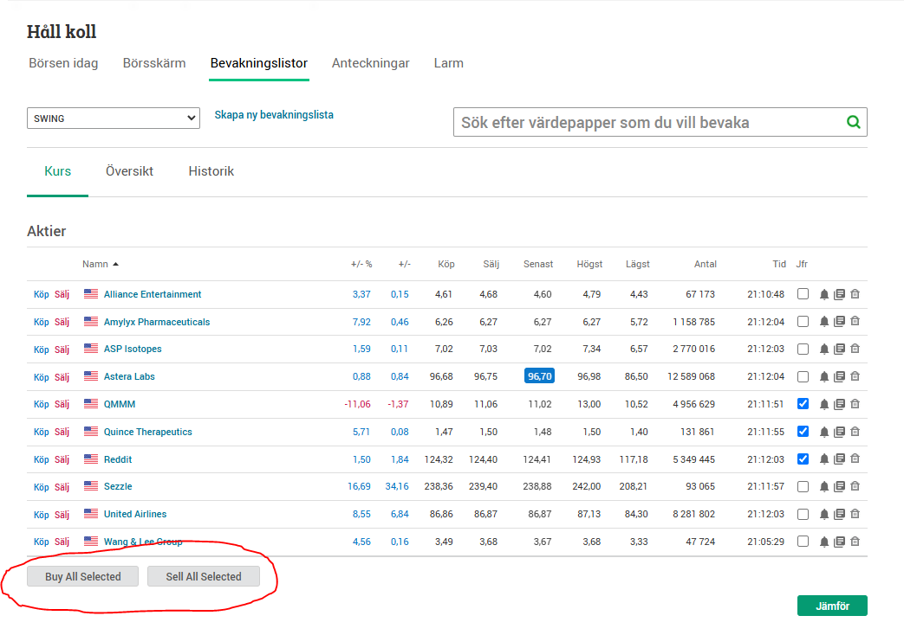
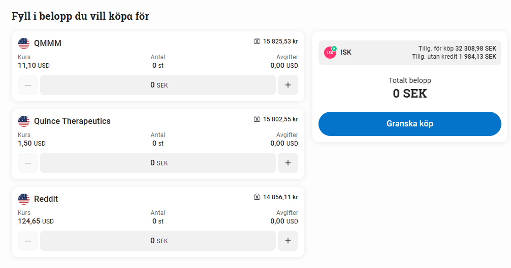

A Tampermonkey script that adds a "Buy All Selected" and "Sell All Selected" button on the bevakningslistor.html page that allows you to select some stocks and then go to the buy/sell page to buy or sell all of them

Clicking the buttons take you to the buy/sell page with the selected stocks pre-selected:

